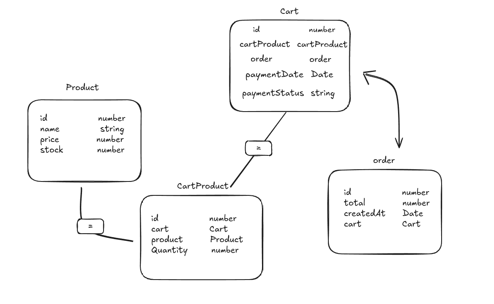

# Shopping API - Desafio Técnico

## Desafio Proposto
O objetivo deste desafio técnico é desenvolver uma API REST capaz de processar e armazenar eventos de compras feitas por usuários e fornecer estatísticas sobre essas compras.

## História do Usuário
Como usuário, desejo visualizar um produto, adicioná-lo ao carrinho de compras e finalizar a compra. Além disso, gostaria de acessar dados estatísticos sobre as compras realizadas, como os produtos mais requisitados e volume de vendas diário.

## Estrutura de Tabelas

O banco de dados da aplicação é composto pelas seguintes entidades:
1. Product
Representa um produto no sistema. A entidade Product possui informações sobre o produto, como nome, preço e estoque disponível.

2. Cart
Representa um carrinho de compras de um usuário. A entidade Cart contém os produtos adicionados ao carrinho e o pedido associado (caso haja).

3. CartProduct
Representa um produto específico dentro de um carrinho. A entidade CartProduct contém a referência ao carrinho e ao produto, além da quantidade do produto no carrinho.

4. Order
Representa um pedido finalizado. A entidade Order contém informações como o total do pedido, a data de criação e o carrinho associado a esse pedido.

## Tecnologias Utilizadas
- *NestJS:* Framework para construir a API REST.
- *TypeORM:* ORM para interação com o banco de dados PostgreSQL.
- *PostgreSQL:* Banco de dados utilizado para armazenar os dados.
- *Class-Validator e Class-Transformer:* Para validação e transformação de dados de entrada.
- *Jest:* Framework de testes para garantir a qualidade da API.
- *ESLint e Prettier:* Ferramentas para garantir a consistência do código e formatação


## Como Rodar o Projeto
1. Clonando o Repositório
Primeiramente, clone o repositório do projeto:
```bash
git clone https://github.com/seu-usuario/shopping-api.git
cd shopping-api
```
2. Instalando as Dependências
Instale as dependências necessárias utilizando o NPM:
```bash
npm install
```
3. Configurando o Banco de Dados
Certifique-se de ter o PostgreSQL instalado e rodando na sua máquina. Você pode configurar o banco de dados ajustando as variáveis de ambiente no arquivo .env:

Exemplo de configuração no `.env`:
```bash
DB_HOST=localhost
DB_PORT=5432
DB_USERNAME=usuario
DB_PASSWORD=senha
DB_NAME=shopping_api
```
4. Rodando o Projeto
Agora, você pode rodar o projeto em modo de desenvolvimento com o seguinte comando:
```bash
npm run start:dev
```
O servidor será iniciado e estará disponível em `http://localhost:3000`.

5. Como Baixar o Postman
Dentro do repositório, você encontrará o arquivo `shopping-api.postman_collection.json`, que contém uma coleção de requisições para testar a API. Para importar essa coleção no Postman, siga os seguintes passos:

1. Abra o Postman.
2. Clique em Import no canto superior esquerdo.
3. Selecione a opção File e escolha o arquivo `shopping-api.postman_collection.json` que está localizado na raiz do projeto.
4. Após importar, você poderá testar os endpoints da API.

